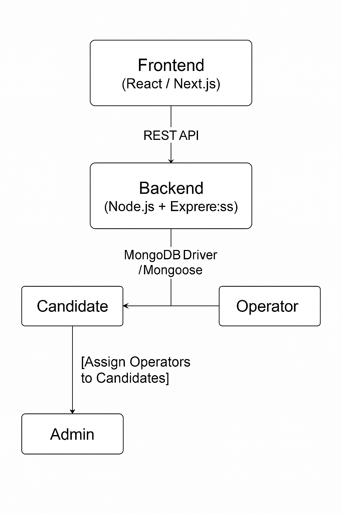

# 💼 Job Application Outsourcing Platform

A web-based platform that helps candidates outsource their job application tasks to dedicated operators. It streamlines resume uploads, job link management, and operator progress tracking — all under admin supervision.

---

## 🚀 Features

- Candidate signup and login
- Resume and cover letter upload
- Upload list of job links
- Operator dashboard for task tracking
- Admin panel for assigning operators to candidates
- Secure authentication and role-based access control

---

## 🏗 Architecture

The platform follows a modular architecture:

- **Frontend:** React or Next.js
- **Backend:** Node.js + Express
- **Database:** MongoDB or PostgreSQL
- **File Storage:** Firebase or AWS S3 (future-proof)

📌 [System Architecture](docs/System-Architecture.md)  
📌 [Technical Architecture](docs/Technical-Architecture.md)

<p align="center">
  
</p>


---

## 📄 Documentation

- 📘 [Requirement Specification](docs/Requirement-Specification.md)
- 🧩 [Database Design](docs/Database-Design.md)
- 🏛 [System Architecture](docs/System-Architecture.md)
- 🏗️ [Technical Architecture](docs/Technical-Architecture.md)

---

## 📦 Tech Stack

| Layer      | Technology           |
|------------|----------------------|
| Frontend   | React / Next.js      |
| Backend    | Node.js + Express    |
| Database   | MongoDB / PostgreSQL |
| Auth       | JWT, bcrypt          |
| Styling    | Tailwind CSS         |
| Storage    | Firebase / AWS S3    |
| Deployment | Vercel / Render      |

---

## 🛠️ Local Setup

```bash
# Clone the repository
git clone https://github.com/your-username/job-app-platform.git

# Navigate to the project folder
cd job-app-platform

# Install dependencies
npm install

# Start the development server
npm run dev
